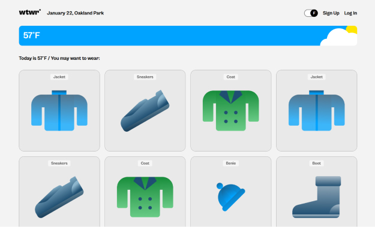

# WTWR App

What to Wear is an app that lets users view and add clothing items tailored to the weather conditions of their current location.

## Features

- User registration
- Log in and log out
- Add clothing items
- Edit user name and avatar
- Like and unlike cards
- The app provides the user's location, current weather temperature (in Celsius or Fahrenheit), and sky conditions.

## Tech Stack

- React, JavaScript, CSS
- API interaction
- React router
- Vite
- Jwt authentication

## Website Domain

- https://forwtwrapp.jumpingcrab.com/

## Backend Link

- https://github.com/dbelfla10/se_project_express
